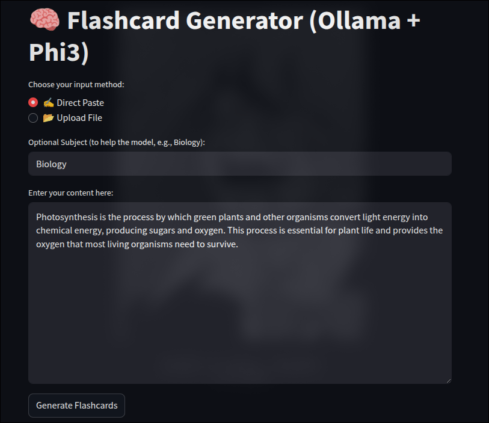
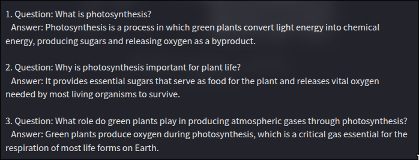
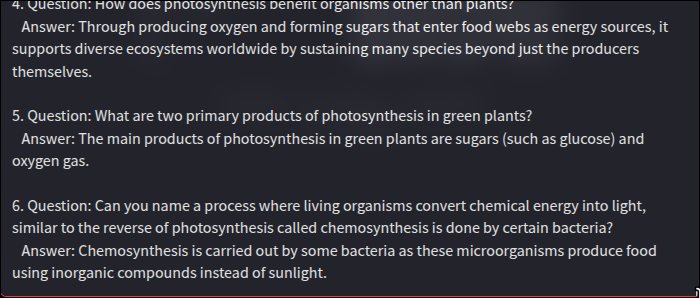
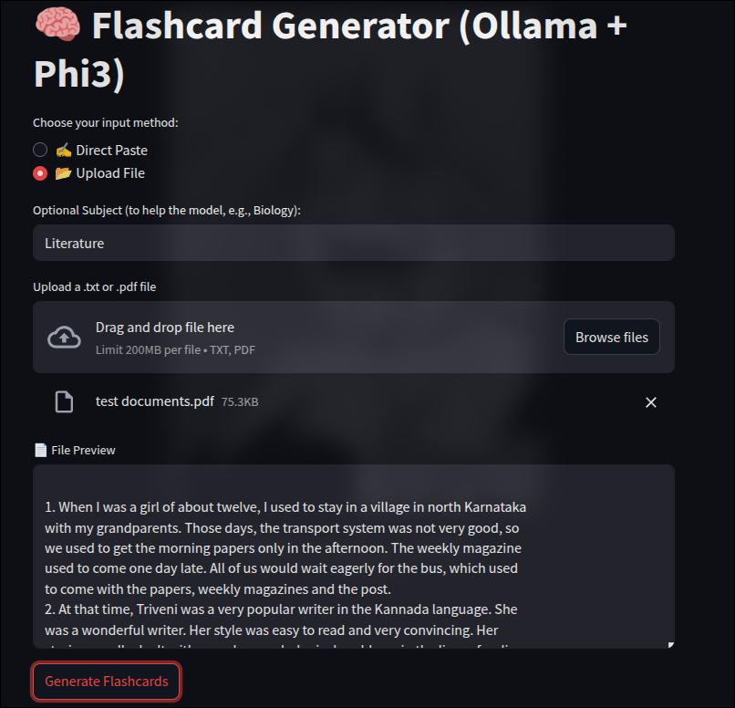

# 🧠 Flashcard Generator (Ollama + Phi3)

This project is a **streamlit-based flashcard generator** that uses a local LLM (like Phi3 via Ollama) to generate concise and accurate flashcards from either:
- ✍️ **Pasted text**
- 📂 **Uploaded `.txt` or `.pdf` files**

---

## 🚀 Features

- Accepts **direct text** or **file upload** as input
- Supports `.txt` and `.pdf` formats
- Uses **Phi3 (via Ollama)** to generate high-quality flashcards
- Categorizes flashcards into `Easy`, `Medium`, and `Hard` difficulty levels
- Outputs up to **10 fact-based question-answer pairs**

---

## 🧩 Tech Stack

- [Streamlit](https://streamlit.io/) — for the UI
- [Ollama](https://ollama.com/) — to run Phi3 LLM locally
- [PyMuPDF (fitz)](https://pymupdf.readthedocs.io/) — for PDF parsing
- [Python](https://www.python.org/)

---

## 📂 Folder Structure

├── ui.py # Streamlit front-end
├── generator.py # LLM communication + parsing logic
└── README.md # You're her


## ⚙️ How to Run

1. Make sure you have `Ollama` running with the **Phi3 model** installed:
   ```bash
   ollama run phi3
2. Install the dependencies:
   pip install streamlit pymupdf requests
3. Start the App :
   streamlit run ui.py

## 📷Example Output 

---

## ✍️ Example 1: Direct Paste Mode

**Input Interface:**



**Sample Output 1:**



**Sample Output 2:**



---

## 📂 Example 2: File Upload Mode

**Upload Interface:**



**Sample Output 1:**


**Sample Output 2:**


